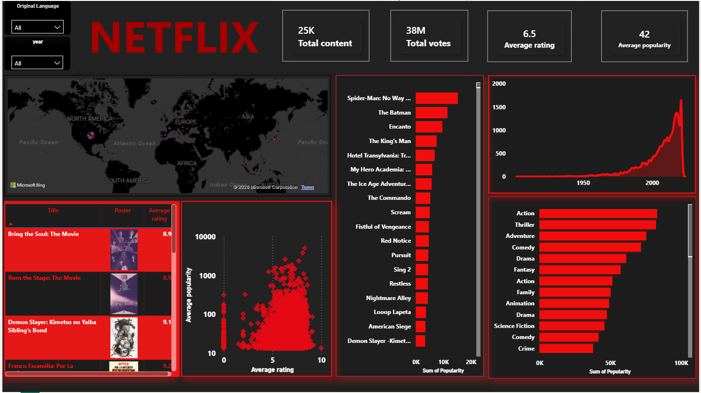

# 🎬 Netflix Content Analytics Dashboard

## 📌 Project Overview
This project is an interactive analytics dashboard designed to visualize Netflix's content distribution, genre trends, and regional availability. The raw data was preprocessed and cleaned in Microsoft Excel to ensure accuracy, then imported into Power BI to uncover insights regarding the platform's historical catalog growth and content strategy.

## 🛠️ Tools & Technologies
*   **Data Cleaning & Preprocessing:** Microsoft Excel
*   **Data Visualization & Modeling:** Power BI
*   **Techniques:** Custom visual layouts, slicers, clustered bar charts, scatter plots, and KPIs.

## 📸 Dashboard Preview

## 🎥 Dashboard Demonstration
[👉 Click here to watch the interactive Dashboard Video Demonstration](netflix.dashboard.recording.mp4)

## 📊 Key Insights & Features
*   **Content Distribution:** Visual breakdown of Movies vs. TV Shows across different years.
*   **Regional Availability:** Mapping out content availability and production volumes by country.
*   **Genre Trends:** Identification of the most popular and fastest-growing genres on the platform.
*   **Interactive Filtering:** Custom slicers allowing users to drill down into specific release years, ratings, and content types.

## 📁 Repository Files
*   `netflix1C.pbix`: The core Power BI dashboard file.
*   `netflix.original.xlsx`: The cleaned dataset used for visualization. 
*   `netflix.dashboard.recording.mp4`: Video demonstration of the dashboard's interactive features.
